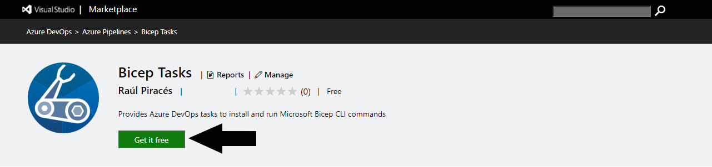
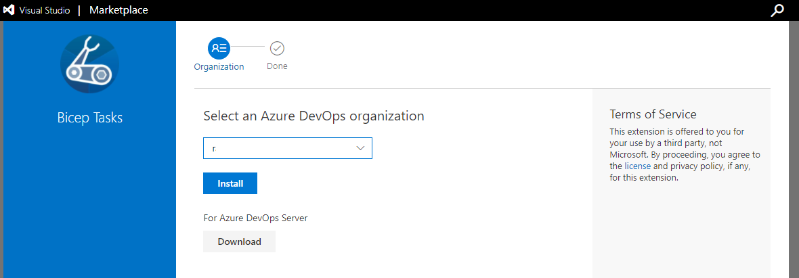
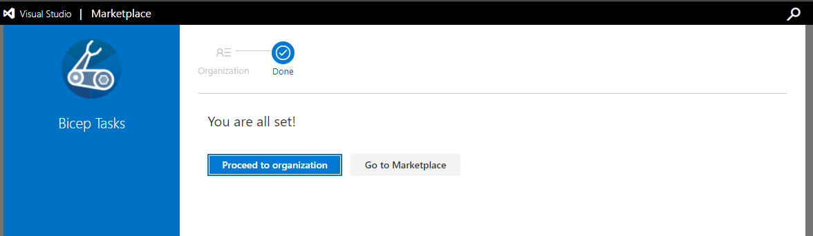
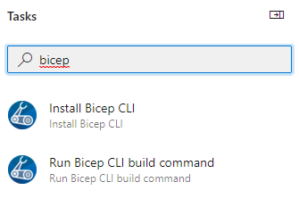

# Quick Start

This short guide will guide you through installing the extension in your organization Azure DevOps and start using it.

## Installation

The installation is pretty straightforward, only visit the marketplace and search for `bicep` or [follow this direct link to the extension](https://marketplace.visualstudio.com/items?itemName=piraces.bicep-tasks).

Once in the marketplace, just press the install button:

After clicking the button, it will redirect you to the installation page where you can choose an organization to install to. Just select the organization and press 'Install':

*Note:* if you are not the correct permissions over the organization it will prompt a message to you to request admins of your organization to approve the installation (this is a normal process), continue explaining why you need the extension and wait for your admins to admit the request.

Finally, it will prompt a message to inform you that the extension has been installed:

**Congrats!** Now, you can make use of the tasks in your pipelines:

